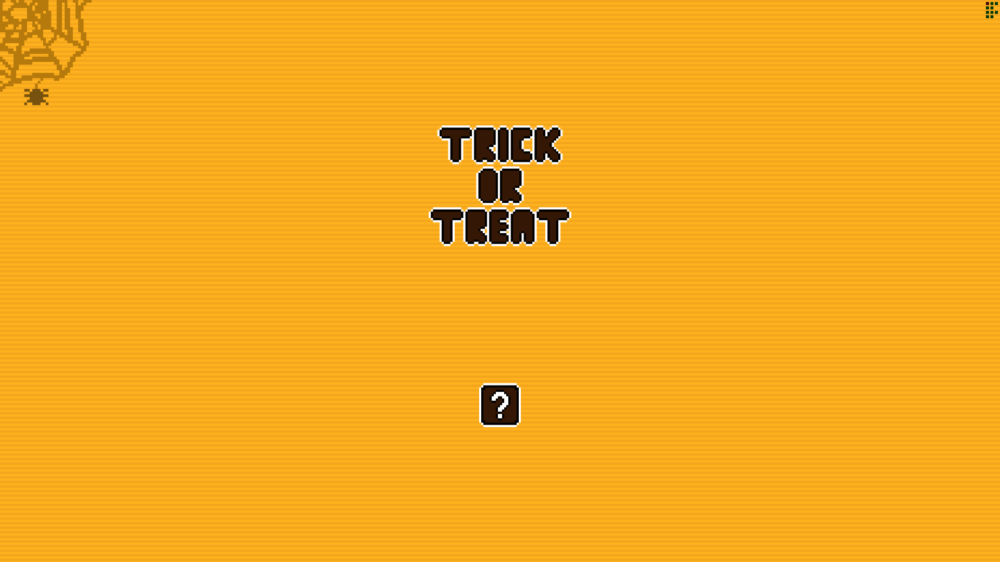

<h1 align="center">
    Trick or Treat
</h1>

<p align="center">
    Website for a giveaway between sweets and challenges!
</p>

<p align="center">
  <a href="https://skillicons.dev">
    
  </a>
</p>

## Content Table

- [Description](#description)
- [Screenshots](#screenshots)
- [Requirements](#requirements)
- [Getting Started](#getting-started)
- [Conventional Commits](#conventional-commits)
- [License](#license)
- [Contact](#contact)

## Description

Trick or Treat was a project made for the school's Halloween event where visitors opened the website and were drawn between sweets or challenges.

## Screenshots




## Requirements

1. `NodeJS >= v16.x`
2. `npm >= v8.x`

## Getting Started

Follow the step-by-step instructions to set up and run the project:

1. Clone the repository:

    ```bash
    git clone https://github.com/Victor101106/Trick-or-Treat.git
    ```

2. Install dependencies:

    ```bash
    npm install
    ```

3. Run the project:

    ```bash
    npm run server
    ```

## Conventional Commits

This project follows the [Conventional Commits](https://www.conventionalcommits.org/) specification to maintain a clean and consistent commit history.

### Commitizen: How to Use

1. Stage your changes:

    ```bash
    git add [<pathspec>...]
    ```

2. Commit using `Commitizen`:

    ```bash
    npm run git:commit
    ```

3. Follow the interactive prompts.
    `Commitizen` will guide you through crafting a proper commit message.

### Message Structure

The commit message should be structured as follows:

```bash
<type>[optional scope]: <description>

[optional body]

[optional footer(s)]
```

#### Example:
```bash
feat(auth): add login functionality
```

## License

Distributed under the MIT license. See [LICENSE](LICENSE.md) for more information.

## Contact

Victor Gabriel • [Github](https://github.com/Victor101106/) • victorgabriel101106+github@gmail.com